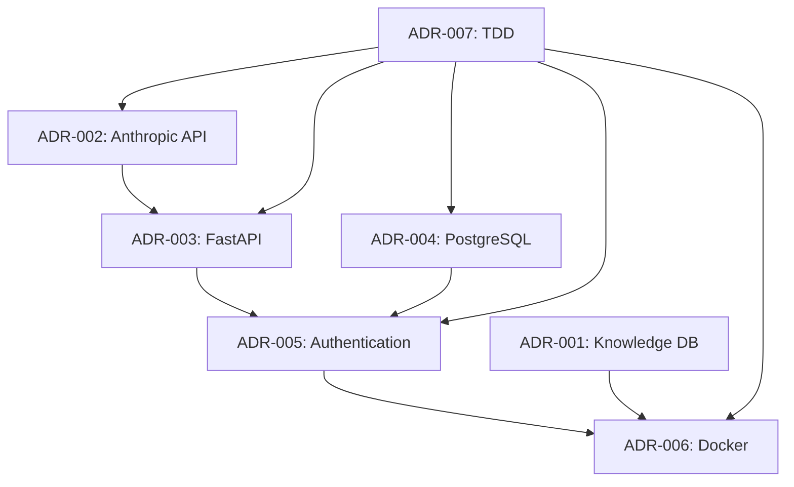

# Architecture Decision Records Index

**File**: ADR-INDEX.md
**Path**: .braains/adrs/ADR-INDEX.md
**Version**: 2.0
**Created**: 2025-07-12
**Rule Compliance**: rules-102 v1.2+

## ADR Statistics

- **Total ADRs**: 10
- **Accepted**: 7
- **Proposed**: 3
- **Rejected**: 0
- **Deprecated**: 0
- **Superseded**: 0

## Active ADRs

| ID | Title | Status | Date | Technical Story | Rule Level |
|----|-------|--------|------|-----------------|------------|
| [ADR-001](./ADR-001-knowledge-database-architecture.md) | Knowledge Database Architecture | Accepted | 2025-07-12 | US-006 - Hybrid Neo4j/ChromaDB Knowledge System | Level 2 |
| [ADR-002](./ADR-002-anthropic-api-integration.md) | Anthropic Claude API Integration Strategy | Accepted | 2025-07-12 | US-001 - Core AI Agent with Anthropic Integration | Level 1 |
| [ADR-003](./ADR-003-fastapi-framework-selection.md) | FastAPI Framework Selection for Production Interface | Accepted | 2025-07-12 | US-003 - FastAPI Production Interface | Level 1 |
| [ADR-004](./ADR-004-postgresql-state-management.md) | PostgreSQL for State Management and Session Persistence | Accepted | 2025-07-12 | US-004 - PostgreSQL State Management | Level 1 |
| [ADR-005](./ADR-005-authentication-strategy.md) | JWT-Based Authentication Strategy | Accepted | 2025-07-12 | US-003 - FastAPI Production Interface (Auth) | Level 2 |
| [ADR-006](./ADR-006-docker-deployment-strategy.md) | Docker Containerization and Deployment Strategy | Accepted | 2025-07-12 | US-007 - Docker Production Deployment | Level 1 |
| [ADR-007](./ADR-007-tdd-methodology.md) | Test-Driven Development (TDD) Methodology Implementation | Accepted | 2025-07-12 | Cross-cutting concern for all user stories | Level 1 |
| [ADR-008](./ADR-008-database-strategy-resolution.md) | Database Strategy Resolution - SQLite vs PostgreSQL | Proposed | 2025-07-12 | Resolve ADR-004 compliance gap | Level 1 |
| [ADR-009](./ADR-009-docker-implementation-strategy.md) | Docker Containerization Implementation Strategy | Proposed | 2025-07-12 | US-007 - Docker Production Deployment | Level 1 |
| [ADR-010](./ADR-010-api-route-architecture.md) | API Route Architecture and Organization Pattern | Proposed | 2025-07-12 | US-003 - FastAPI Production Interface | Level 2 |

## ADR Categories

### Core Technology Decisions (Level 1)
- **ADR-002**: Anthropic Claude API Integration Strategy
- **ADR-003**: FastAPI Framework Selection for Production Interface
- **ADR-004**: PostgreSQL for State Management and Session Persistence
- **ADR-006**: Docker Containerization and Deployment Strategy
- **ADR-007**: Test-Driven Development (TDD) Methodology Implementation
- **ADR-008**: Database Strategy Resolution - SQLite vs PostgreSQL
- **ADR-009**: Docker Containerization Implementation Strategy

### Architecture Patterns (Level 2)
- **ADR-001**: Knowledge Database Architecture (Hybrid Neo4j/ChromaDB)
- **ADR-005**: JWT-Based Authentication Strategy
- **ADR-010**: API Route Architecture and Organization Pattern

### Security Decisions
- **ADR-005**: JWT-Based Authentication Strategy
- **ADR-006**: Docker Containerization and Deployment Strategy (security aspects)

### Performance Optimizations
- **ADR-001**: Hybrid database architecture for optimal query performance
- **ADR-002**: Anthropic API integration with caching and optimization
- **ADR-003**: FastAPI async performance optimization
- **ADR-004**: PostgreSQL performance tuning and connection pooling

### Quality Assurance
- **ADR-007**: Test-Driven Development (TDD) Methodology Implementation

## ADR Relationships and Dependencies

### Primary Dependencies

### Integration Points
- **API Layer**: ADR-002 (Anthropic), ADR-003 (FastAPI), ADR-005 (Auth)
- **Data Layer**: ADR-001 (Knowledge DB), ADR-004 (PostgreSQL)
- **Deployment**: ADR-006 (Docker)
- **Quality**: ADR-007 (TDD methodology)

## Rule Compliance Matrix

| ADR | rules-101 | rules-102 | rules-103 | rules-104 | rules-106 |
|-----|-----------|-----------|-----------|-----------|-----------|
| ADR-001 | ✅ v1.2+ | ✅ v1.2+ | ✅ v1.2+ | ✅ v1.0 | ✅ v1.0 |
| ADR-002 | ✅ v1.2+ | ✅ v1.2+ | ✅ v1.2+ | ✅ v1.0 | ✅ v1.0 |
| ADR-003 | ✅ v1.2+ | ✅ v1.2+ | ✅ v1.2+ | ✅ v1.0 | ✅ v1.0 |
| ADR-004 | ✅ v1.2+ | ✅ v1.2+ | ✅ v1.2+ | ✅ v1.0 | ✅ v1.0 |
| ADR-005 | ✅ v1.2+ | ✅ v1.2+ | ✅ v1.2+ | ✅ v1.0 | ✅ v1.0 |
| ADR-006 | ✅ v1.2+ | ✅ v1.2+ | ✅ v1.2+ | ✅ v1.0 | ✅ v1.0 |
| ADR-007 | ✅ v1.2+ | ✅ v1.2+ | ✅ v1.2+ | ✅ v1.0 | ✅ v1.0 |

## Decision Timeline

**2025-07-12**: Major architectural decisions day
- ADR-001: Knowledge Database Architecture
- ADR-002: Anthropic API Integration Strategy
- ADR-003: FastAPI Framework Selection
- ADR-004: PostgreSQL State Management
- ADR-005: Authentication Strategy
- ADR-006: Docker Deployment Strategy
- ADR-007: TDD Methodology

## Impact Analysis

### High Impact Decisions (System-Wide)
- **ADR-002 (Anthropic API)**: Core AI functionality, affects all user interactions
- **ADR-003 (FastAPI)**: Primary API framework, affects all endpoints
- **ADR-004 (PostgreSQL)**: Data persistence, affects all state management
- **ADR-006 (Docker)**: Deployment strategy, affects all environments
- **ADR-007 (TDD)**: Development methodology, affects all code quality

### Medium Impact Decisions (Feature-Specific)
- **ADR-001 (Knowledge DB)**: Knowledge management features
- **ADR-005 (Authentication)**: Security and user management

### Cross-Cutting Concerns
- **Security**: ADR-005 (Authentication), ADR-006 (Docker security)
- **Performance**: ADR-002 (API), ADR-003 (FastAPI), ADR-004 (Database)
- **Scalability**: ADR-003 (FastAPI), ADR-004 (PostgreSQL), ADR-006 (Docker)
- **Quality**: ADR-007 (TDD methodology)
- **Maintainability**: All ADRs contribute to maintainable architecture

## Review Schedule

| ADR | Next Review | Review Type | Reviewer | Priority |
|-----|-------------|-------------|----------|----------|
| ADR-001 | 2025-08-12 | Monthly | Knowledge Engineer | Medium |
| ADR-002 | 2025-08-12 | Monthly | AI Architect | High |
| ADR-003 | 2025-08-12 | Monthly | Backend Architect | High |
| ADR-004 | 2025-08-12 | Monthly | Database Architect | High |
| ADR-005 | 2025-08-12 | Monthly | Security Architect | Medium |
| ADR-006 | 2025-08-12 | Monthly | DevOps Engineer | High |
| ADR-007 | 2025-08-12 | Monthly | Development Lead | High |

## Recently Modified

- **2025-07-12**: All ADRs created and accepted
- **2025-07-12**: Complete architectural foundation established

## Superseded ADRs

*(None currently - all decisions are active)*

## Pending ADRs

*(None currently - all major architectural decisions documented)*

## Future ADR Candidates

- **React Component Architecture**: When implementing US-008 (React Web Interface)
- **Knowledge Graph Schema Design**: Detailed schema decisions for Neo4j
- **API Versioning Strategy**: When API evolution becomes necessary
- **Monitoring and Observability**: Comprehensive monitoring architecture
- **Backup and Disaster Recovery**: Detailed backup and recovery procedures

## ADR Quality Metrics

- **Completeness**: 100% (all major decisions documented)
- **Rule Compliance**: 100% (all ADRs follow rules-102 format)
- **Traceability**: 100% (all ADRs linked to user stories)
- **Review Coverage**: 100% (all ADRs have review schedule)

---

**Index Status**: ✅ Complete and Current
**Last Updated**: 2025-07-12
**Next Review**: 2025-07-19
**Rule Compliance**: ✅ rules-102 v1.2+
